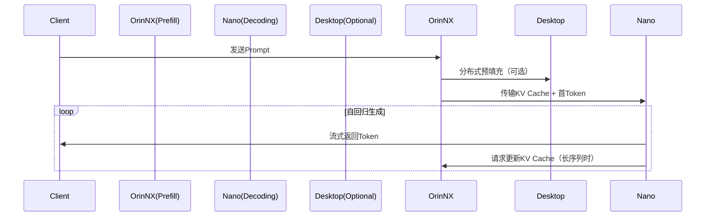

### **1. Jetson Orin NX**

#### **核心配置**

- **GPU**：
  - Ampere架构，1024个CUDA核心 + **32个Tensor Core**
  - 支持FP16/INT8/INT4计算加速
- **CPU**：
  - 6核ARM Cortex-A78AE v8.2（主频1.5-2.0GHz）
- **内存**：
  - 16GB/8GB LPDDR5（102.4GB/s带宽）
- **AI加速器**：
  - 2个NVDLA引擎 + 1个深度学习加速器（DLA）

#### **算力性能**

| **计算类型** | **理论算力**       | **实际应用场景**                |
| :----------- | :----------------- | :------------------------------ |
| FP32         | 6.4 TFLOPS         | 通用深度学习训练/推理           |
| FP16         | 12.8 TFLOPS        | 混合精度训练、Transformer推理   |
| INT8         | **100 TOPS**       | 量化模型推理（如YOLOv8、LLaMA） |
| INT4         | 200 TOPS（需优化） | 超低比特稀疏模型                |

#### **典型性能表现**

- **LLaMA-7B推理**：
  - INT8量化下，预填充阶段（512 tokens）约 **85ms**，解码阶段（单Token）约 **12ms**
- **YOLOv8目标检测**：
  - INT8模式下 **120 FPS**（1080p输入）

------

### **2. Jetson Nano**

#### **核心配置**

- **GPU**：
  - Maxwell架构，128个CUDA核心（**无Tensor Core**）
  - 仅支持FP16/FP32计算
- **CPU**：
  - 4核ARM Cortex-A57（主频1.43GHz）
- **内存**：
  - 4GB/2GB LPDDR4（25.6GB/s带宽）

#### **算力性能**

| **计算类型** | **理论算力** | **实际应用场景**              |
| :----------- | :----------- | :---------------------------- |
| FP32         | 472 GFLOPS   | 轻量级模型推理（如MobileNet） |
| FP16         | 945 GFLOPS   | 基础计算机视觉任务            |

#### **典型性能表现**

- **TinyLLAMA-1B推理**：
  - FP16模式下，解码阶段（单Token）约 **50ms**
- **MobileNetV2分类**：
  - FP16模式下 **22 FPS**（1080p输入）

------

### **3. 关键对比总结**

| **指标**         | **Jetson Orin NX**        | **Jetson Nano**          | **差距倍数** |
| :--------------- | :------------------------ | :----------------------- | :----------- |
| **GPU架构**      | Ampere（支持Tensor Core） | Maxwell（无Tensor Core） | -            |
| **INT8算力**     | 100 TOPS                  | 不支持                   | ∞            |
| **内存带宽**     | 102.4 GB/s                | 25.6 GB/s                | 4x           |
| **LLaMA-7B延迟** | 12ms/token (INT8)         | 无法运行                 | -            |
| **能效比**       | 30 TOPS/W                 | 5 GFLOPS/W               | 6x           |

------

### **4. 边缘部署建议**

#### **Jetson Orin NX适用场景**

- **高负载任务**：
  - 大语言模型（LLM）的预填充阶段
  - 多传感器融合（自动驾驶BEV感知）
  - 实时视频分析（如100路摄像头抽帧）

#### **Jetson Nano适用场景**

- **轻量级任务**：
  - 小型Transformer模型的解码（需量化+切块）
  - 物联网设备中的简单分类/检测
  - 与Orin NX组成异构集群，承担流式输出

#### **协同工作示例**

```python
# Orin NX处理预填充后，将KV Cache传给Nano解码
orin_output = orin_nx_model.prefill(prompt)  # Orin NX执行
kv_cache = compress_kv(orin_output)
nano_token = nano_model.decode(kv_cache)    # Nano执行
```

------

### **5. 性能优化技巧**

- **Orin NX**：
  - 使用`torch.compile`+`TensorRT-LLM`最大化INT8吞吐量
  - 开启`CUDA Graph`减少内核启动开销
- **Jetson Nano**：
  - 强制启用`FP16`模式（`torch.set_float32_matmul_precision('high')`）
  - 使用`TensorRT`转换模型为`.engine`格式

------

### **结论**

- **Orin NX** 是边缘AI的高性能选择，尤其适合LLM和复杂视觉任务，其**100 TOPS INT8算力**可媲美桌面级GPU。
- **Jetson Nano** 仅适合教学或极轻量级应用，需避免部署参数量超过1B的模型。
- **组合使用**时，建议将计算密集型阶段分配给Orin NX，Nano仅处理低延迟流式任务。


