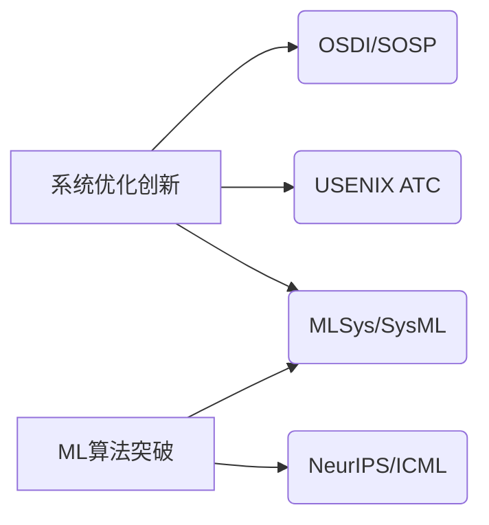
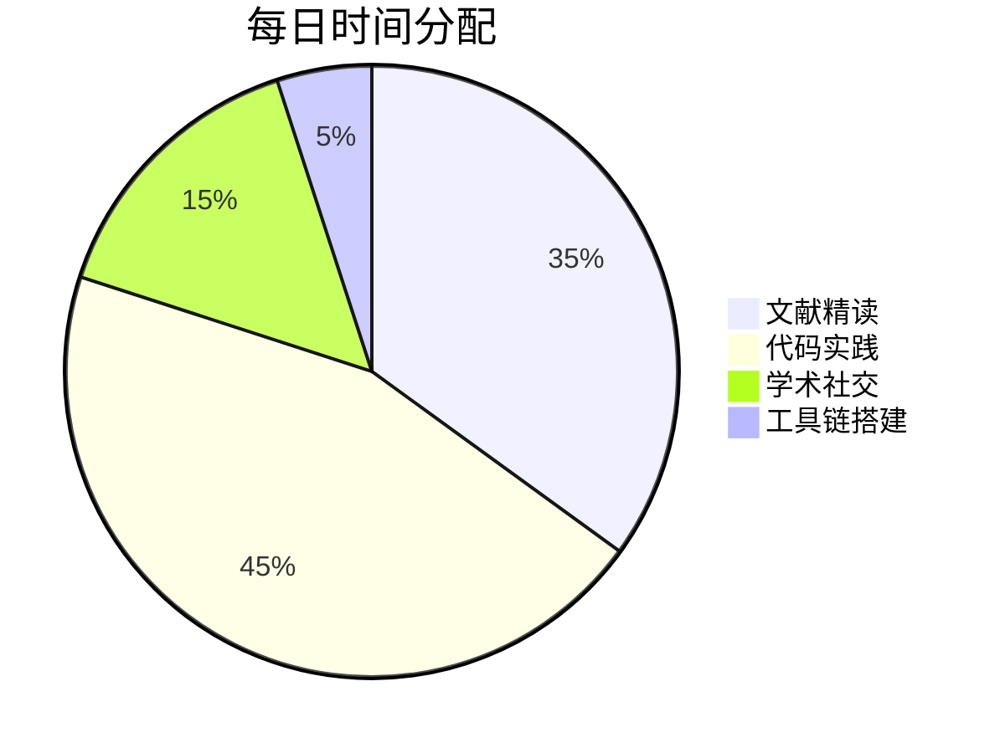
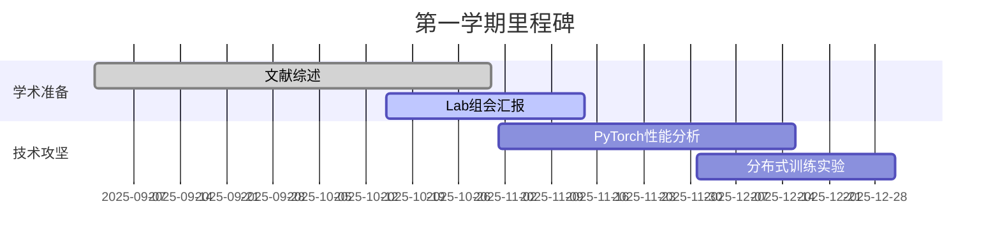
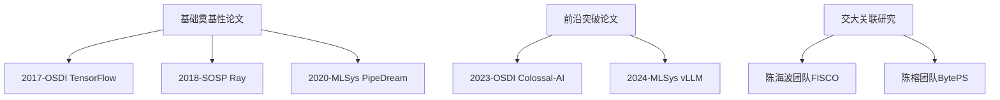
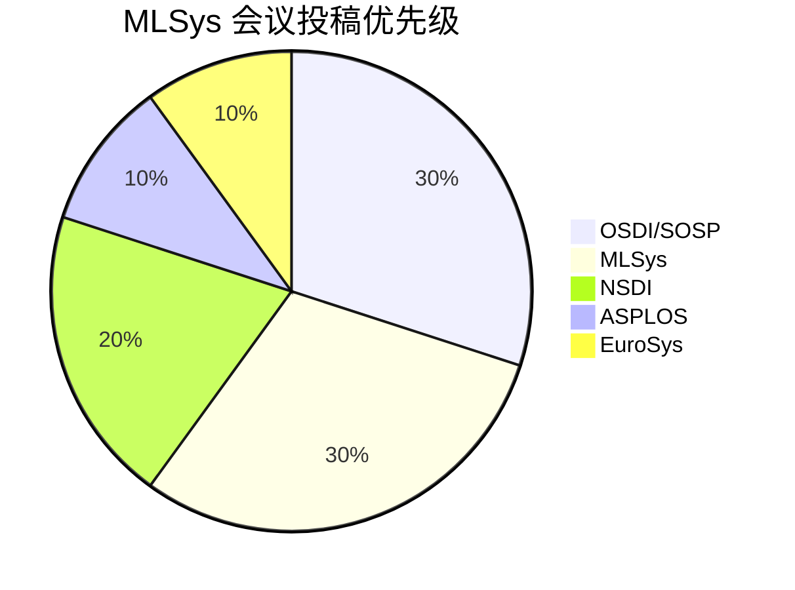

## 一、入学前到博士申请博后整体计划

### 一、顶级CS博士后核心门槛（以CMU/MIT为例）

1. **学术硬指标**
   - **论文质量**：至少3-4篇CCF-A类/CS顶会一作（如SOSP/OSDI+NeurIPS/ICML）
   - **研究影响力**：有被领域内知名学者引用的工作（理想情况是引发follow-up研究）
   - **学术网络**：与目标实验室有合作论文/会议交流记录
2. **隐形标准**
   - 研究方向的稀缺性（如MLSys/边缘智能系统等交叉领域）
   - 具备独立提出研究问题并设计解决方案的能力

### 二、六年制硕博连读分阶段规划

#### **第0年（入学前）**

- ✅ **紧急任务**：
  - 精读近3年SOSP/OSDI+ML顶会最佳论文（建立领域认知框架）
  - 掌握PyTorch/TensorFlow源码级调试能力（ML系统方向刚需）
  - 联系未来导师确认实验室的硬件资源（GPU集群规模等）

#### **第1-2年（硕士阶段）**

- **核心目标**：产出1篇CCF-B类以上一作 + 建立技术壁垒
- 📌 关键动作：
  - 主攻可扩展的ML系统方向（如分布式训练框架优化）
  - 选修体系结构/分布式系统核心课程（交大CS347等）
  - 参与开源项目（如PyTorch贡献commit记录）
  - 每周保持20+小时coding时间（系统方向需要极强工程能力）

#### **第3-4年（博士过渡期）**

- **生死线**：在ATC/EuroSys级别会议突破
- 🔥 破局策略：
  - 与海外导师建立合作（通过邮件套磁+会议拜访）
  - 开发有区分度的工具（如ML调试工具包，争取GitHub 500+ stars）
  - 申请NVIDIA/微软亚洲研究院联培（积累工业界视角）

#### **第5-6年（博士冲刺期）**

- **决胜点**：做出有记忆点的研究（如解决MLSys领域公认痛点）
- 🚀 必须达成：
  - 至少1项被工业界采用的技术方案（如被TensorFlow官方集成）
  - 建立个人学术标签（比如"XX问题的张氏解法"）
  - 在USENIX ATC等会议担任PC member

### 三、论文发表策略（ML+系统方向黄金组合）




建议采用"双螺旋"发表路线：每年至少1篇系统顶会+1篇ML顶会，最终形成交叉影响力。

### 四、海外联培关键窗口期

- **最佳时机**：博士第3年结束前（需提前1年准备）
- **目标项目**：
  - CMU的CoLab计划（系统方向首选）
  - MIT CSAIL的Visiting Student Program
  - Berkeley RISELab实习（关注Joe Hellerstein组）

### 五、风险控制方案

1. **备选路径**：
   - 若顶会进度滞后，转投IEEE TPDS等高质量期刊
   - 通过Kaggle/MLSys竞赛获奖弥补论文短板（如MLPerf冠军）
2. **时间红线**：
   - 第4年结束前未发表A类论文需启动备选计划
   - 保持与产业界的联系（避免学术道路中断风险）

### 六、推荐学习资源（交大特供版）

- 系统方向：旁听陈海波老师《操作系统前沿》课程
- ML方向：参与张伟楠老师的RL科研组会
- 工具链：善用交大π2.0超算平台做大规模实验

你现在需要立即行动：

1. 制作文献追踪表（建议用Notion管理）
2. 加入ACM班精英社群（交大CS隐性资源）
3. 开始复现MLSys'23最佳论文代码（GitHub上建立技术博客）

记住：在ML+系统领域，**可复现的技术深度**比论文数量更重要。建议保持每周40%时间读论文、40%时间写代码、20%时间学术社交的时间分配。前两年要忍受"不发表"的寂寞，重点打磨底层能力。


## 二、最近一年计划

### **2025年5-8月（入学前黄金准备期）**

**核心目标**：建立技术壁垒+预研潜在课题
**时间分配**（建议每日10-12小时）：



**具体任务**：

1. **文献攻坚（重点！）**
   - 精读MLSys近三年最佳论文（2023-2025 MLSys/OptiML会议）
   - 建立文献矩阵表（比较SOSP/OSDI与NeurIPS论文的方法论差异）
   - *工具推荐*：用Connected Papers生成领域知识图谱
2. **代码实战**
   - 复现1篇MLSys'24的开源论文（重点学习实验复现技巧）
   - 参与PyTorch源码贡献（从文档改进开始，目标获得1个merged PR）
   - *必做项目*：用Rust重写一个分布式ML组件（展示系统能力）
3. **提前布局**
   - 联系未来导师获取实验室技术栈清单（提前搭建开发环境）
   - 加入交大IPADS实验室的预研小组（即使非正式成员）

------

### **2025年9-12月（硕士第一学期）**

**核心目标**：确定研究方向+建立学术存在感
**时间分配**（课程:科研:工程=3:4:3）：



**关键动作**：

- 选修陈海波《高级操作系统》课程（重点学习论文研讨部分）
- 在组会中做2次技术报告（主题建议：GNN训练系统优化）
- 建立个人学术主页（用GitHub Pages展示复现成果）

------

### **2026年1-6月（硕士第二学期）**

**生死线**：产出首个可投稿成果
**攻关策略**：

- 瞄准2026 MLSys会议（截止日期通常为7月）
- 开发"ML训练过程可视化调试工具"（兼具系统和ML价值）
- *时间分配*：早9-12点写代码，下午读论文，晚上做实验

------

### **关键时间节点检查表**

| 时间节点   | 必须达成目标               | 风险预警               |
| :--------- | :------------------------- | :--------------------- |
| 2026年6月  | 完成首个系统原型           | 若未完成需启动备选课题 |
| 2027年12月 | 发表1篇CCF-B类一作         | 否则考虑转硕           |
| 2029年3月  | 至少2篇A类论文             | 决定是否申请海外联培   |
| 2030年6月  | 建立完整research statement | 开始博士后申请         |

------

### **每周执行模板（入学后）**

```python
def weekly_schedule():
    mornings = ["代码开发"]*4 + ["论文写作"]*1
    afternoons = ["课程学习", "组会准备", "实验分析", "文献精读", "学术社交"]
    evenings = ["工具链优化"]*3 + ["健身/休息"]*2
    
    # 特别提醒
    assert time_management(weekends="论文复现") != "打游戏", "保持专注！"
```

**立即行动清单**：

1. 今天注册GitHub账号并star这些仓库：
   - [MLSys](https://github.com/mlcommons)
   - [PyTorch](https://github.com/pytorch/pytorch)
2. 下载2025 SOSP录用论文包（交大VPN可访问）
3. 预约6月份IPADS实验室开放日参观

记住：在系统领域，**代码能力=学术货币**。建议从现在开始每天保持200+行高质量代码输出，这将直接决定你两年后能冲击哪些级别的会议。


## 三、MLSys新人入门指南

以下是针对MLSys新人的终极入门指南，结合领域特点和你（上海交大系统方向）的实际情况定制：

------

### **一、论文阅读优先级清单（从核心到拓展）**



<svg role="graphics-document document" viewBox="0 0 1668.671875 174" class="flowchart mermaid-svg" xmlns="http://www.w3.org/2000/svg" width="100%" id="mermaid-svg-74" style="max-width: 1668.67px; transform-origin: 0px 0px; user-select: none; transform: translate(0px, 60.7969px) scale(1);"><g><marker orient="auto" markerHeight="8" markerWidth="8" markerUnits="userSpaceOnUse" refY="5" refX="5" viewBox="0 0 10 10" class="marker flowchart-v2" id="mermaid-svg-74_flowchart-v2-pointEnd"><path style="stroke-width: 1; stroke-dasharray: 1, 0;" class="arrowMarkerPath" d="M 0 0 L 10 5 L 0 10 z"></path></marker><marker orient="auto" markerHeight="8" markerWidth="8" markerUnits="userSpaceOnUse" refY="5" refX="4.5" viewBox="0 0 10 10" class="marker flowchart-v2" id="mermaid-svg-74_flowchart-v2-pointStart"><path style="stroke-width: 1; stroke-dasharray: 1, 0;" class="arrowMarkerPath" d="M 0 5 L 10 10 L 10 0 z"></path></marker><marker orient="auto" markerHeight="11" markerWidth="11" markerUnits="userSpaceOnUse" refY="5" refX="11" viewBox="0 0 10 10" class="marker flowchart-v2" id="mermaid-svg-74_flowchart-v2-circleEnd"><circle style="stroke-width: 1; stroke-dasharray: 1, 0;" class="arrowMarkerPath" r="5" cy="5" cx="5"></circle></marker><marker orient="auto" markerHeight="11" markerWidth="11" markerUnits="userSpaceOnUse" refY="5" refX="-1" viewBox="0 0 10 10" class="marker flowchart-v2" id="mermaid-svg-74_flowchart-v2-circleStart"><circle style="stroke-width: 1; stroke-dasharray: 1, 0;" class="arrowMarkerPath" r="5" cy="5" cx="5"></circle></marker><marker orient="auto" markerHeight="11" markerWidth="11" markerUnits="userSpaceOnUse" refY="5.2" refX="12" viewBox="0 0 11 11" class="marker cross flowchart-v2" id="mermaid-svg-74_flowchart-v2-crossEnd"><path style="stroke-width: 2; stroke-dasharray: 1, 0;" class="arrowMarkerPath" d="M 1,1 l 9,9 M 10,1 l -9,9"></path></marker><marker orient="auto" markerHeight="11" markerWidth="11" markerUnits="userSpaceOnUse" refY="5.2" refX="-1" viewBox="0 0 11 11" class="marker cross flowchart-v2" id="mermaid-svg-74_flowchart-v2-crossStart"><path style="stroke-width: 2; stroke-dasharray: 1, 0;" class="arrowMarkerPath" d="M 1,1 l 9,9 M 10,1 l -9,9"></path></marker><g class="root"><g class="clusters"></g><g class="edgePaths"><path marker-end="url(#mermaid-svg-74_flowchart-v2-pointEnd)" style="" class="edge-thickness-normal edge-pattern-solid edge-thickness-normal edge-pattern-solid flowchart-link" id="L_A_B_0" d="M270.711,53.593L244.957,59.161C219.203,64.729,167.695,75.864,141.941,84.932C116.188,94,116.188,101,116.188,104.5L116.188,108"></path><path marker-end="url(#mermaid-svg-74_flowchart-v2-pointEnd)" style="" class="edge-thickness-normal edge-pattern-solid edge-thickness-normal edge-pattern-solid flowchart-link" id="L_A_C_0" d="M356.711,62L356.711,66.167C356.711,70.333,356.711,78.667,356.711,86.333C356.711,94,356.711,101,356.711,104.5L356.711,108"></path><path marker-end="url(#mermaid-svg-74_flowchart-v2-pointEnd)" style="" class="edge-thickness-normal edge-pattern-solid edge-thickness-normal edge-pattern-solid flowchart-link" id="L_A_D_0" d="M442.711,53.355L468.983,58.963C495.255,64.57,547.799,75.785,574.072,84.893C600.344,94,600.344,101,600.344,104.5L600.344,108"></path><path marker-end="url(#mermaid-svg-74_flowchart-v2-pointEnd)" style="" class="edge-thickness-normal edge-pattern-solid edge-thickness-normal edge-pattern-solid flowchart-link" id="L_E_F_0" d="M928.35,62L918.425,66.167C908.499,70.333,888.648,78.667,878.722,86.333C868.797,94,868.797,101,868.797,104.5L868.797,108"></path><path marker-end="url(#mermaid-svg-74_flowchart-v2-pointEnd)" style="" class="edge-thickness-normal edge-pattern-solid edge-thickness-normal edge-pattern-solid flowchart-link" id="L_E_G_0" d="M1056.986,62L1066.911,66.167C1076.837,70.333,1096.688,78.667,1106.613,86.333C1116.539,94,1116.539,101,1116.539,104.5L1116.539,108"></path><path marker-end="url(#mermaid-svg-74_flowchart-v2-pointEnd)" style="" class="edge-thickness-normal edge-pattern-solid edge-thickness-normal edge-pattern-solid flowchart-link" id="L_H_I_0" d="M1402.091,62L1393.005,66.167C1383.92,70.333,1365.749,78.667,1356.664,86.333C1347.578,94,1347.578,101,1347.578,104.5L1347.578,108"></path><path marker-end="url(#mermaid-svg-74_flowchart-v2-pointEnd)" style="" class="edge-thickness-normal edge-pattern-solid edge-thickness-normal edge-pattern-solid flowchart-link" id="L_H_J_0" d="M1519.839,62L1528.924,66.167C1538.01,70.333,1556.181,78.667,1565.266,86.333C1574.352,94,1574.352,101,1574.352,104.5L1574.352,108"></path></g><g class="edgeLabels"><g class="edgeLabel"><g transform="translate(0, 0)" class="label"><foreignObject height="0" width="0"><div class="labelBkg" xmlns="http://www.w3.org/1999/xhtml" style="background-color: rgba(232, 232, 232, 0.5); display: table-cell; white-space: nowrap; line-height: 1.5; max-width: 200px; text-align: center;"><span class="edgeLabel" style="fill: rgb(51, 51, 51); color: rgb(51, 51, 51); background-color: rgba(232, 232, 232, 0.8); text-align: center;"></span></div></foreignObject></g></g><g class="edgeLabel"><g transform="translate(0, 0)" class="label"><foreignObject height="0" width="0"><div class="labelBkg" xmlns="http://www.w3.org/1999/xhtml" style="background-color: rgba(232, 232, 232, 0.5); display: table-cell; white-space: nowrap; line-height: 1.5; max-width: 200px; text-align: center;"><span class="edgeLabel" style="fill: rgb(51, 51, 51); color: rgb(51, 51, 51); background-color: rgba(232, 232, 232, 0.8); text-align: center;"></span></div></foreignObject></g></g><g class="edgeLabel"><g transform="translate(0, 0)" class="label"><foreignObject height="0" width="0"><div class="labelBkg" xmlns="http://www.w3.org/1999/xhtml" style="background-color: rgba(232, 232, 232, 0.5); display: table-cell; white-space: nowrap; line-height: 1.5; max-width: 200px; text-align: center;"><span class="edgeLabel" style="fill: rgb(51, 51, 51); color: rgb(51, 51, 51); background-color: rgba(232, 232, 232, 0.8); text-align: center;"></span></div></foreignObject></g></g><g class="edgeLabel"><g transform="translate(0, 0)" class="label"><foreignObject height="0" width="0"><div class="labelBkg" xmlns="http://www.w3.org/1999/xhtml" style="background-color: rgba(232, 232, 232, 0.5); display: table-cell; white-space: nowrap; line-height: 1.5; max-width: 200px; text-align: center;"><span class="edgeLabel" style="fill: rgb(51, 51, 51); color: rgb(51, 51, 51); background-color: rgba(232, 232, 232, 0.8); text-align: center;"></span></div></foreignObject></g></g><g class="edgeLabel"><g transform="translate(0, 0)" class="label"><foreignObject height="0" width="0"><div class="labelBkg" xmlns="http://www.w3.org/1999/xhtml" style="background-color: rgba(232, 232, 232, 0.5); display: table-cell; white-space: nowrap; line-height: 1.5; max-width: 200px; text-align: center;"><span class="edgeLabel" style="fill: rgb(51, 51, 51); color: rgb(51, 51, 51); background-color: rgba(232, 232, 232, 0.8); text-align: center;"></span></div></foreignObject></g></g><g class="edgeLabel"><g transform="translate(0, 0)" class="label"><foreignObject height="0" width="0"><div class="labelBkg" xmlns="http://www.w3.org/1999/xhtml" style="background-color: rgba(232, 232, 232, 0.5); display: table-cell; white-space: nowrap; line-height: 1.5; max-width: 200px; text-align: center;"><span class="edgeLabel" style="fill: rgb(51, 51, 51); color: rgb(51, 51, 51); background-color: rgba(232, 232, 232, 0.8); text-align: center;"></span></div></foreignObject></g></g><g class="edgeLabel"><g transform="translate(0, 0)" class="label"><foreignObject height="0" width="0"><div class="labelBkg" xmlns="http://www.w3.org/1999/xhtml" style="background-color: rgba(232, 232, 232, 0.5); display: table-cell; white-space: nowrap; line-height: 1.5; max-width: 200px; text-align: center;"><span class="edgeLabel" style="fill: rgb(51, 51, 51); color: rgb(51, 51, 51); background-color: rgba(232, 232, 232, 0.8); text-align: center;"></span></div></foreignObject></g></g></g><g class="nodes"><g transform="translate(356.7109375, 35)" id="flowchart-A-0" class="node default"><rect height="54" width="172" y="-27" x="-86" style="" class="basic label-container"></rect><g transform="translate(-56, -12)" style="" class="label"><rect></rect><foreignObject height="24" width="112"><div xmlns="http://www.w3.org/1999/xhtml" style="display: table-cell; white-space: nowrap; line-height: 1.5; max-width: 200px; text-align: center;"><span class="nodeLabel" style="fill: rgb(51, 51, 51); color: rgb(51, 51, 51);"><p style="margin: 0px;">基础奠基性论文</p></span></div></foreignObject></g></g><g transform="translate(116.1875, 139)" id="flowchart-B-1" class="node default"><rect height="54" width="216.375" y="-27" x="-108.1875" style="" class="basic label-container"></rect><g transform="translate(-78.1875, -12)" style="" class="label"><rect></rect><foreignObject height="24" width="156.375"><div xmlns="http://www.w3.org/1999/xhtml" style="display: table-cell; white-space: nowrap; line-height: 1.5; max-width: 200px; text-align: center;"><span class="nodeLabel" style="fill: rgb(51, 51, 51); color: rgb(51, 51, 51);"><p style="margin: 0px;">2017-OSDI TensorFlow</p></span></div></foreignObject></g></g><g transform="translate(356.7109375, 139)" id="flowchart-C-3" class="node default"><rect height="54" width="164.671875" y="-27" x="-82.3359375" style="" class="basic label-container"></rect><g transform="translate(-52.3359375, -12)" style="" class="label"><rect></rect><foreignObject height="24" width="104.671875"><div xmlns="http://www.w3.org/1999/xhtml" style="display: table-cell; white-space: nowrap; line-height: 1.5; max-width: 200px; text-align: center;"><span class="nodeLabel" style="fill: rgb(51, 51, 51); color: rgb(51, 51, 51);"><p style="margin: 0px;">2018-SOSP Ray</p></span></div></foreignObject></g></g><g transform="translate(600.34375, 139)" id="flowchart-D-5" class="node default"><rect height="54" width="222.59375" y="-27" x="-111.296875" style="" class="basic label-container"></rect><g transform="translate(-81.296875, -12)" style="" class="label"><rect></rect><foreignObject height="24" width="162.59375"><div xmlns="http://www.w3.org/1999/xhtml" style="display: table-cell; white-space: nowrap; line-height: 1.5; max-width: 200px; text-align: center;"><span class="nodeLabel" style="fill: rgb(51, 51, 51); color: rgb(51, 51, 51);"><p style="margin: 0px;">2020-MLSys PipeDream</p></span></div></foreignObject></g></g><g transform="translate(992.66796875, 35)" id="flowchart-E-6" class="node default"><rect height="54" width="156" y="-27" x="-78" style="" class="basic label-container"></rect><g transform="translate(-48, -12)" style="" class="label"><rect></rect><foreignObject height="24" width="96"><div xmlns="http://www.w3.org/1999/xhtml" style="display: table-cell; white-space: nowrap; line-height: 1.5; max-width: 200px; text-align: center;"><span class="nodeLabel" style="fill: rgb(51, 51, 51); color: rgb(51, 51, 51);"><p style="margin: 0px;">前沿突破论文</p></span></div></foreignObject></g></g><g transform="translate(868.796875, 139)" id="flowchart-F-7" class="node default"><rect height="54" width="214.3125" y="-27" x="-107.15625" style="" class="basic label-container"></rect><g transform="translate(-77.15625, -12)" style="" class="label"><rect></rect><foreignObject height="24" width="154.3125"><div xmlns="http://www.w3.org/1999/xhtml" style="display: table-cell; white-space: nowrap; line-height: 1.5; max-width: 200px; text-align: center;"><span class="nodeLabel" style="fill: rgb(51, 51, 51); color: rgb(51, 51, 51);"><p style="margin: 0px;">2023-OSDI Colossal-AI</p></span></div></foreignObject></g></g><g transform="translate(1116.5390625, 139)" id="flowchart-G-9" class="node default"><rect height="54" width="181.171875" y="-27" x="-90.5859375" style="" class="basic label-container"></rect><g transform="translate(-60.5859375, -12)" style="" class="label"><rect></rect><foreignObject height="24" width="121.171875"><div xmlns="http://www.w3.org/1999/xhtml" style="display: table-cell; white-space: nowrap; line-height: 1.5; max-width: 200px; text-align: center;"><span class="nodeLabel" style="fill: rgb(51, 51, 51); color: rgb(51, 51, 51);"><p style="margin: 0px;">2024-MLSys vLLM</p></span></div></foreignObject></g></g><g transform="translate(1460.96484375, 35)" id="flowchart-H-10" class="node default"><rect height="54" width="156" y="-27" x="-78" style="" class="basic label-container"></rect><g transform="translate(-48, -12)" style="" class="label"><rect></rect><foreignObject height="24" width="96"><div xmlns="http://www.w3.org/1999/xhtml" style="display: table-cell; white-space: nowrap; line-height: 1.5; max-width: 200px; text-align: center;"><span class="nodeLabel" style="fill: rgb(51, 51, 51); color: rgb(51, 51, 51);"><p style="margin: 0px;">交大关联研究</p></span></div></foreignObject></g></g><g transform="translate(1347.578125, 139)" id="flowchart-I-11" class="node default"><rect height="54" width="180.90625" y="-27" x="-90.453125" style="" class="basic label-container"></rect><g transform="translate(-60.453125, -12)" style="" class="label"><rect></rect><foreignObject height="24" width="120.90625"><div xmlns="http://www.w3.org/1999/xhtml" style="display: table-cell; white-space: nowrap; line-height: 1.5; max-width: 200px; text-align: center;"><span class="nodeLabel" style="fill: rgb(51, 51, 51); color: rgb(51, 51, 51);"><p style="margin: 0px;">陈海波团队FISCO</p></span></div></foreignObject></g></g><g transform="translate(1574.3515625, 139)" id="flowchart-J-13" class="node default"><rect height="54" width="172.640625" y="-27" x="-86.3203125" style="" class="basic label-container"></rect><g transform="translate(-56.3203125, -12)" style="" class="label"><rect></rect><foreignObject height="24" width="112.640625"><div xmlns="http://www.w3.org/1999/xhtml" style="display: table-cell; white-space: nowrap; line-height: 1.5; max-width: 200px; text-align: center;"><span class="nodeLabel" style="fill: rgb(51, 51, 51); color: rgb(51, 51, 51);"><p style="margin: 0px;">陈榕团队BytePS</p></span></div></foreignObject></g></g></g></g></g></svg>

**必读10篇论文**（按阅读顺序）：

1. **TensorFlow: A System for Large-Scale Machine Learning** (OSDI'16)
2. **Ray: A Distributed Framework for Emerging AI Applications** (OSDI'18)
3. **PipeDream: Generalized Pipeline Parallelism for DNN Training** (SOSP'19)
4. **Megatron-LM: Training Multi-Billion Parameter Language Models** (MLSys'20)
5. **Colossal-AI: A Unified Deep Learning System** (OSDI'23)
6. **vLLM: Easy, Fast, and Cheap LLM Serving** (MLSys'24)
7. **FISCO: Accelerate ML Training via Filtering Self-Contradictory Samples** (ASPLOS'23)
8. **BytePS: High Performance Distributed Training Framework** (NSDI'20)
9. **The Case for Learned Index Structures** (SIGMOD'18)
10. **Horovod: fast and easy distributed training** (arXiv'18)

**精读技巧**：

- 第一遍：用康奈尔笔记法记录**系统设计痛点→解决方案→实验验证方法**
- 第二遍：用`git blame`查看相关开源项目的代码实现
- 第三遍：绘制论文的**系统架构演进时间轴**

------

### **二、会议期刊关注清单（MLSys方向）**

**顶级会议优先级**：



**必须追踪的渠道**：

1. **会议ddl日历**：https://mlsys.org/conferences/
2. **arXiv最新论文**：`cs.DC`+`cs.LG`分类
3. **GitHub趋势库**：关注`mlsys`/`distributed-training`标签
4. **交大特别资源**：IPADS实验室内部技术报告（入学后获取）

------

### **三、新人每日时间配方（动态调整版）**

**理想时间分配公式**：

```
每日科研时间 = 0.4*(代码/实验) + 0.3*(论文阅读) + 0.2*(数学基础) + 0.1*(学术社交)
```

**具体时刻表（参考IPADS实验室作息）**：

| 时间段      | 活动内容     | 工具/方法                                           |
| :---------- | :----------- | :-------------------------------------------------- |
| 8:00-9:00   | 晨间论文速读 | 使用Scholarcy快速解析2篇arXiv新论文                 |
| 9:30-11:30  | 核心代码时间 | Vim/VSCode + Tmux分屏（左侧代码/右侧论文）          |
| 14:00-15:00 | 系统课程学习 | 重点攻克《Distributed Systems》(MIT 6.824) 课程实验 |
| 16:00-17:30 | 实验室组会   | 提前准备3页技术报告（必须含性能对比表格）           |
| 20:00-21:00 | 开源贡献     | 提交PyTorch/TensorFlow文档改进PR（每周至少1个）     |
| 21:30-22:30 | 数学补强     | 精读《Probability for Computing》(MIT 6.436)        |

**碎片时间利用**：

- 食堂排队：刷MLSys Subreddit的"New Papers"板块
- 实验排队：用手机SSH检查GPU集群状态
- 睡前15分钟：用Anki复习今日学术关键词

------

### **四、快速成长加速器**

1. **交大专属捷径**：
   - 蹭听陈海波《操作系统前沿》课程（周三晚7点电院3号楼）
   - 加入交大JHC高性能计算俱乐部（接触A100集群）
2. **工具链建设**：
   - 开发自己的MLSys工具箱（包含：训练监控/性能分析/错误注入）
   - 使用WandB记录所有实验（形成可追溯的研究日志）
3. **学术社交技巧**：
   - 在GitHub讨论区提问（比邮件更易获得回复）
   - 会议后主动联系作者要代码（成功率＞70%）

------

### **五、关键里程碑检查点**

| 时间节点 | 预期成果                  | 预警信号          |
| :------- | :------------------------ | :---------------- |
| 第3个月  | 完成首个Ray分布式修改版   | 若未跑通MNIST示例 |
| 第6个月  | 提交1篇MLSys Workshop论文 | 错过投稿ddl       |
| 第12个月 | 在CCF-B类会议发表一作     | 被连续拒稿3次     |
| 第18个月 | 开发出被引用的开源工具    | GitHub stars＜50  |

**立即行动**：

1. 今天就在GitHub创建`mlsys-notes`仓库
2. 订阅OSDI'25会议通知（9月开放投稿）
3. 下载vLLM源码并部署测试环境

记住：在MLSys领域，**能跑通的代码比完美的理论更重要**。建议保持"每天提交代码+每周精读1篇顶会+每月复现1个系统"的节奏，两年后你会站在完全不同的高度。