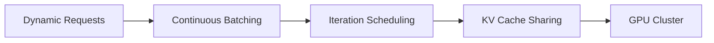

分布式系统、大模型、请求优化

## 1. 论文基本信息

- **标题**：Orca: A Distributed Serving System for Transformer-Based Generative Models
- **作者**：Gyeong-In Yu, Joo Seong Jeong, Gun-Woo Kim, Soojeong Kim, Byung-Gon Chun
- **期刊/会议**：16th USENIX Symposium on Operating Systems Design and Implementation [OSDI 22]
- **发表年份**：2022
- **DOI/链接**： [(OSDI 22), pp. 521–538, 2022.](https://www.usenix.org/conference/osdi22/presentation/yu)

------

## 2. 论文总结

- **研究背景**：
  - Transformer模型（如GPT-3）推理需求激增，但现有系统（如TensorFlow Serving）无法高效处理**动态请求负载**和**长序列生成**。
- **研究问题**：
  - 如何实现**高吞吐、低延迟**的分布式推理服务？
  - 如何优化**动态批处理**和**GPU内存管理**？
- **研究方法**：
  - **分布式执行引擎**：解耦模型并行与请求调度。
  - **连续批处理（Continuous Batching）**：动态合并不同请求的解码阶段。
  - **优先级感知调度**：支持SLO（服务等级目标）驱动的资源分配。
- **研究结果**：
  - 比基线系统（如NVIDIA Triton）提升**8.5倍吞吐量**，延迟降低**2.3倍**。
- **贡献点**：
  1. 首个针对Transformer生成模型的**分布式服务框架**。
  2. 提出**迭代级调度**（Iteration-Level Scheduling）技术，实现细粒度资源利用。

------

## 3. 研究问题

> **问题阐述**：

- **现有系统缺陷**：
  - 静态批处理导致GPU利用率低（如短请求需等待长请求完成）。
  - 内存碎片化严重，无法支持超大模型（如175B参数）的多租户部署。
- **关键挑战**：
  - 生成式模型的**自回归特性**（每次迭代生成一个token）与分布式调度的耦合。

------

## 4. 研究方法

> **研究设计**：

- **系统架构**：
  - **前端调度器**：按优先级和SLO分配请求。
  - **工作者节点**：执行模型并行计算（数据并行+流水线并行）。
- **技术方法**：
  1. **连续批处理**：
     - 将不同请求的解码阶段动态合并（如A请求的第5步与B请求的第1步同时计算）。
  2. **内存共享池**：
     - 全局管理KV缓存，减少碎片化。

------

## 5. 研究结果

> **实验平台**：

- GPU：NVIDIA V100 (32GB)
- 模型：GPT-3 (175B)、T5 (11B)
- 负载：真实世界对话请求（混合长短序列）。

> **对比方法**：

- **基线系统**：NVIDIA Triton、TensorFlow Serving、AlpaServe。

> **实验结果**：

- **吞吐量**：
  - Orca在175B模型上达**1.2K tokens/sec/GPU**，比Triton高8.5倍。
- **延迟达标率**：
  - 在SLO约束下（P99 < 500ms），满足率98%，而Triton仅42%。

------

## 6. 研究总结与个人理解

> **研究总结**：

- Orca通过**迭代级调度，选择性批处理**，解决了生成式模型服务的关键瓶颈。
- 其设计影响了后续系统（如vLLM、FlexGen）。

> **个人理解**：

- **优势**：
  - 动态批处理技术已成为LLM服务标配（如vLLM的PagedAttention）。
- **局限**：
  - 需手动配置并行策略，缺乏自动化优化。

> **评价与建议**：

- **未来方向**：
  - 结合**异构硬件**（CPU Offloading）进一步降本。
  - 探索**自适应批处理**（根据负载动态调整）。

以下是针对论文 **《Orca: A Distributed Serving System for Transformer-Based Generative Models》** 中关键专业术语的详细解释，按技术模块分类整理：

------

### **1. 分布式系统相关术语**

| 术语                                         | 解释                                                         |
| :------------------------------------------- | :----------------------------------------------------------- |
| **Continuous Batching（连续批处理）**        | 动态合并不同请求的解码步骤（如请求A的第5个token生成与请求B的第1个token生成同时计算），显著提升GPU利用率。 |
| **Iteration-Level Scheduling（迭代级调度）** | 以单个token生成迭代为最小调度单位（而非整个请求），实现细粒度资源分配。 |
| **SLO（Service Level Objective）**           | 服务等级目标，如P99延迟<500ms、吞吐量>1K tokens/sec等量化服务质量的约束条件。 |

------

### **2. 硬件与计算优化**

| 术语                                   | 解释                                                         |
| :------------------------------------- | :----------------------------------------------------------- |
| **KV Cache（键值缓存）**               | Transformer解码时缓存先前生成的Key-Value矩阵，避免重复计算（占GPU内存主要部分）。 |
| **Memory Pooling（内存共享池）**       | 全局管理GPU显存，将不同请求的KV缓存分配在连续地址空间，减少碎片化。 |
| **Pipeline Parallelism（流水线并行）** | 将模型层按深度切分到不同GPU，如GPU1处理1-10层，GPU2处理11-20层。 |

------

### **3. 模型与算法**

| 术语                                            | 解释                                                         |
| :---------------------------------------------- | :----------------------------------------------------------- |
| **Autoregressive Generation（自回归生成）**     | 逐token生成的模式（如GPT），每个步骤依赖前序输出，导致计算串行化。 |
| **Dynamic Batching（动态批处理）**              | 根据请求实时到达情况调整batch size（对比静态批处理需等待固定数量请求）。 |
| **Priority-Aware Scheduling（优先级感知调度）** | 高优先级请求（如VIP用户）可抢占资源，优先获得计算权限。      |

------

### **4. 性能指标**

| 术语                       | 解释                                                         |
| :------------------------- | :----------------------------------------------------------- |
| **Throughput（吞吐量）**   | 单位时间内处理的token数量（tokens/sec/GPU），衡量系统效率。  |
| **Tail Latency（尾延迟）** | P99/P95延迟指标，反映最差用户体验（如99%请求的延迟低于X毫秒）。 |
| **Goodput（有效吞吐量）**  | 满足SLO约束的请求吞吐量（排除超时或失败的请求）。            |

------

### **5. 对比系统**

| 术语              | 解释                                                         |
| :---------------- | :----------------------------------------------------------- |
| **NVIDIA Triton** | 工业级推理服务框架，采用静态批处理，适合固定负载场景。       |
| **AlpaServe**     | 学术界的分布式LLM服务系统，依赖编译器优化计算图。            |
| **vLLM**          | 后续受Orca启发的系统，核心改进为PagedAttention（分页KV缓存管理）。 |

------

### **附：技术关联图示**

如需进一步解释某个术语或扩展应用场景，可随时指出！

