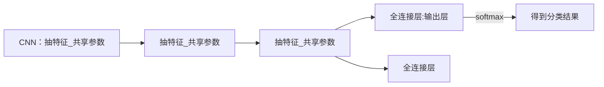

1、高效通信

如果通讯开销比较大，计算开销比较小，在发送数据时候可以对数据进行压缩 (如果数据是稀疏矩阵，也需要进行压缩，对稀疏矩阵的压缩能够显著减少数据传输量)：增加计算开销，降低通讯开销

KKT条件：如果KKT condition比较小的话，可以认为参数不会有变化，也就不需要更新数据

2、数据一致性：向量钟

3、弹性可扩展性：一致性哈希

4、**容灾** (可以用到Hermes的实验中)：一致性哈希

5、资源调度：在复杂系统中，可先用向量钟检测因果/并发，再对因果依赖的部分进行拓扑排序。

6、易用性

一致性哈希（Consistent Hashing）

* 用途
  解决分布式系统中数据分片（如缓存、数据库）的负载均衡和动态扩缩容问题，最小化节点增减时的数据迁移成本。

* 核心思想
  环形哈希空间：将哈希值空间组织成一个环（例如 0 到 2^32-1）。

  节点与数据映射：将节点和数据都哈希到环上，数据按顺时针方向归属到最近的节点。

  虚拟节点：通过为物理节点分配多个虚拟节点，平衡负载分布，避免热点问题。

* 优势
  动态扩展：增加或删除节点时，仅需迁移相邻节点的数据，而非全局重新哈希。

  负载均衡：虚拟节点使数据分布更均匀。

* 应用场景
  分布式缓存（如 Redis Cluster、Memcached）。

  负载均衡（如请求路由）。

  分布式存储系统（如 Dynamo、Cassandra）。

减少模型推理延迟的几个方法：

1、进行系统结构级别的创新：

